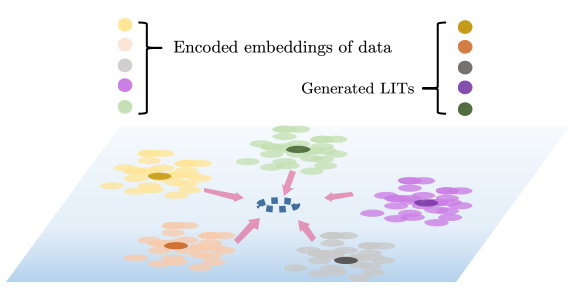

# FedLIT
Please contact jiaji010616@gmail.com for inquiries. Thanks. 

# Introduction

* Intuition of LIT 



* Architecture of FedLIT


>**Federated Multimodal and Multiresolution Data Integration for Dataset Optimization**
>
> Jia Ji and Islem Rekik
>
> BASIRA Lab, Imperial-X and Department of Computing, Imperial College London, London, UK
>
 **Multi-modal image fusion aims to create a more comprehensive and enriched representation by combining image data from multiple modalities. Recent advances in machine learning and deep learning have transformed image fusion, primarily focusing on subject-wise fusion. While intra-modality fusion (i.e., image integration) has gained traction in neuroscience, its broader application in general image processing remains limited. In this study, we introduce a novel concept known as Latent Image Template (LIT), which integrates shared characteristics among individuals within a specific modality in a single template. By integarting image data from diverse modalities and resolutions, LIT can be extended into a universal LIT. To ensure privacy during LIT learning, we propose FedLIT, an autoencoder-based architecture utilizing federated learning. We introduce a centeredness loss that promotes alignment of embeddings from different modalities towards a common global center, preserving cross-modal data privacy. The comprehensive information within the universal LIT holds potential for downstream tasks like one-shot augmentation, even without access to other modalities' data. Augmented data from the universal LIT exhibits multi-modality features. Our study comprehensively evaluates the generated LIT's representativeness, local centeredness, and global centeredness. Additionally, we indirectly assess LIT quality by measuring the impact of augmented data on boosting classifiers.**

## Code
This code was implemented using Python 3.8.16 (Anaconda) on Linux 5.15.0-82-generic x86_64

## Data Format
We conducted extensive experiments using the publicately available dataset Morpho-MNIST (download at https://github.com/dccastro/Morpho-MNIST). Morpho-MNIST is an expansion of the MNIST dataset, augmented with various perturbations such as thinning, thickening, swelling, and fractures, as depicted in the figure.  These synthetic perturbations facilitate the simulation of domain shift scenarios. Beyond its multi-domain nature, the images were upsampled during preprocessing to simulate a multi-resolution environment, implying heterogeneous architectures across clients.  The varying resolutions across the five modalities.


## Installation
### *Anaconda Installattion*
* Go to  https://www.anaconda.com/products/individual
* Download version for your system (We used Python 3.8.16  on Linux 5.15.0-82-generic x86_64)
 )
* Install the platform
* Create a conda environment by typing:  ```conda create –n FedLIT pip python=3.8.16 ```


## Run Fed2M
To run our code, open up a terminal at FedLIT’s directory and type in
```sh
$ conda activate FedLIT & python main.py
```
#####  You may edit config.py to tune hyperparameters of FedLIT, configure training or supply your own dataset.
#####  You may edit experiments/exp_config.py to adjust the training, test, and augmentation sizes..

## Components of Fed2M’s Code
| Component | Content |
| ------ | ------ |
| config.py | Includes hyperparameter and other options. You may modify it according to your needs. |
| vae.py | Implementation of the model. |
| demo.py | Create clients , server, and simulate federated learning (cross-validation)
| main.py| Driver code that import variables from config.py and trains Fed2M (cross-validation).  |
| helper.py| Includes some helper functions |
| loss.py | Includes loss functions used in FedLIT |
| plot.py | plot generated CBT, training log and evaluation log |
| output/model name/ | After the training, this directory includes model parameters, final CBT, and subject biased CBTs for each fold. |
| temp/ | Includes interim model parameters that are saved for each 10 epoch. Deleted after the training.  |
| classifier_data/ | The local training data and global test data for each client's classifier |
| origin_data/ | Access the Morpho-MNIST dataset, which includes various morphological transformations such as thinning, thickening, raw images, swelling, and fractures. Download it from https://github.com/dccastro/Morpho-MNIST. Additionally, ensure you acquire the 'data_util.py' file from the 'experiments/diversity' directory and place it in the 'origin_data' folder for seamless functionality.|
| preprocess_data | resize origin_data to simulate multi-resolution environment. |
| data | Resized origin_data |
| experiments/ | Execute experiments on augmentation, one-shot learning, and classification. Visualize the distribution of both the ground-truth dataset and the augmented dataset. |
#####  output/model name/ and temp/ directories created by demo.py
#####  classifier_data/ created by experiments/generate_mixed_test_data.py
##### data/ created by preprocess_data.py

## Example Result
All client's data domains overlap, and client-specific LITs converge towards a global center, thereby implicitly becoming a universal LIT.

